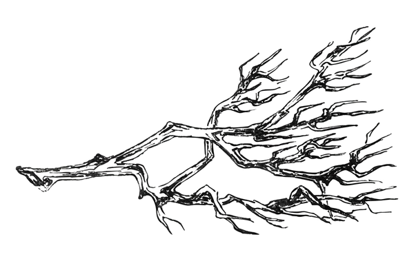

  

# 🕯️ Carlos Hat-trick
### <i>Onde a luz encontra a sombra, o código ganha vida.</i>

 

---

## 🌲 Crônicas do Exterior

<table border="0" width="100%">
<tr>

<td width="60%" valign="top">

### 🌑 A Maldição do Conhecimento
Aprofundando-me em **HTML**, **CSS**, **Python** e **Flask** —  
lapidando a lógica com o rigor das hachuras.

 

### ☕ O Chá da Tarde
Projetos minimalistas.  
Interfaces silenciosas.  
Experiências que contam histórias.

 

### 📍 Território
Sul do Brasil — onde a névoa encontra o código.

</td>

<td width="40%" align="center" valign="top">

</td>

</tr>
</table>

---

---

## 🌫️ Fragmento do Exterior

---

---

## ✒️ Runas e Hachuras

---

---

## 🌑 Registros da Floresta

  

<i>"Entre o Interior e o Exterior, escolhi escrever meu próprio destino."</i>

